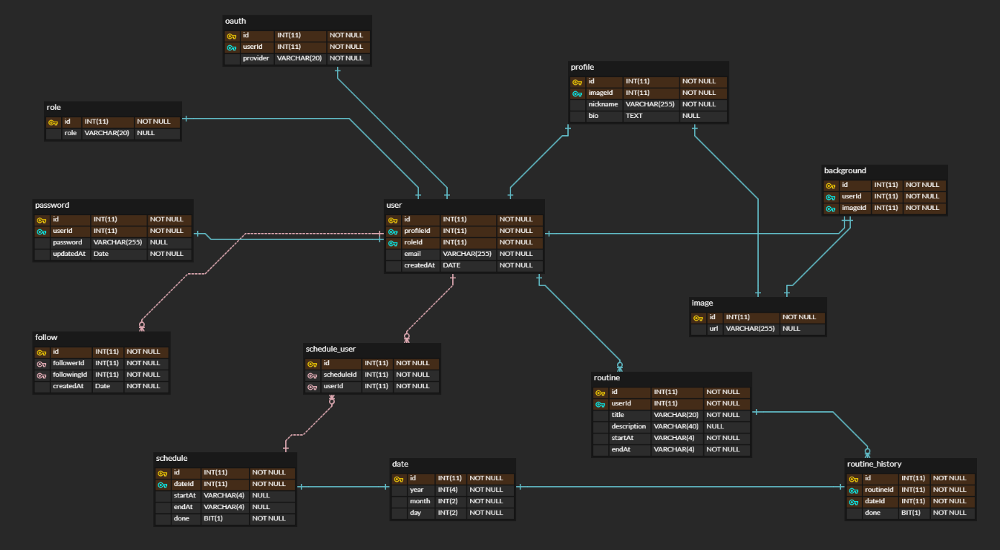

## 사이드 프로젝트 진행 경과

사이드 프로젝트를 시작한 지 어느덧 4주째다.
처음 써보는 PostgreSQL과 TypeORM, 도커 적용하기, 헥사고날 아키텍처, 테스팅 등,
단기간에 완성시키기 보다는 배운 것을 적용시켜 나가자는 취지로 시작하긴 했지만
(내가 맡은 백엔드의) 개발 속도가 느려도 너무 느리다,,,
처음에는 테이블을 머릿 속으로만 설계하고, 이것저것 고민하다 보니 개발이 지체되었고,
최근에는 3개 밖에 안되는 테이블이지만 이것저것 변경하면서 개발이 지체되고 있다.
테이블 하나를 변경하면 프로덕션 코드부터 테스트 코드까지 건드려야 하기 때문이다.
상황이 이렇다 보니 이런 식으로 진행해선 안되겠다는 생각이 들었다.
그 동안 고민해 왔던 것들을 ERD로 그려 놓고, 이에 맞춰 개발을 진행해 나가는 것이
기획 변경에 따른 부수효과도 줄이고,
팀원들과 의견을 나누기에도 수월할 것 같아 ERD를 먼저 그리기로 했다.

## Planit ERD 초안

ERD 툴은 ERD CLOUD(https://www.erdcloud.com/)를 사용했는데,
생각보다 사용 방법이 어렵지 않아 금방 적응했다.
뿐만 아니라 인기있는 ERD를 참고할 수 있어서 많은 도움이 됐다.
가장 인기있는 ERD는 개발자 커뮤니티인 OKKY의 ERD다.
ERD를 직접 그리면서 느낀 가장 큰 장점은
시각적으로 관계를 살펴보면서 생각을 정리할 수 있다는 것이었다.
이전에는 머릿 속으로만, 팀원들과 회의를 하면서만 막연하게 정리해오던 걸
명확하게 표현하는 과정 자체가 큰 도움이 됐다.
뭐든 직접 해보면서 배우는 게 최고의 지름길이란 걸 잊고 있었다.
ERD를 그리면서 가장 중점을 맞춘 부분은 '정규화'인데,
RDB의 가장 큰 특징이 정규화인 만큼 데이터 중복을 최소화하는 초점을 맞췄다.

## 배우고 느낀 것

ERD를 그리면서 얻은 또 하나의 수확은 기능명세서 작성의 필요성을 느낀 것이다.
사이드 프로젝트를 진행하면서 스크럼에서 나온 내용들을 기반으로 기능을 개발하고 있었는데,
막상 전체적으로 어떤 기능을 어떻게 개발할 것인지는 논의를 해보지 못했던 것 같다.
사이드 프로젝트라 기획 단계를 간소화해서 진행하긴 했지만,
어쨌든 기능 명세에 대해서는 약식으로라도 한 번 정리하고 가야겠다는 다짐(?)을 하게 됐다.
Password 테이블을 User 테이블에서 분리하는 과정에서
비밀번호의 최종 수정일을 기준으로 비밀번호 변경을 권유할 수 있는 기능을 구현해보기로 한 것,
Oauth 구현 시 Refresh Token을 사용할 수 있다는 걸 새롭게 배운 것 등
적지 않은 배움을 2시간 남짓 ERD를 그리면서 얻을 수 있었다.

## Next Step

주말 동안 사이드 프로젝트의 전체적인 기능 명세서를 작성해볼 예정이다.
또한 새로운 기능 개발 보다는 정규화를 먼저 진행하고,
Entity들도 미리 작성하고 관계가 제대로 설계되었는 지도 검토해보려고 한다.
Happy Coding! 😊
