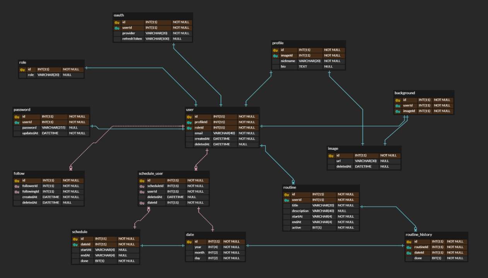

## TL;DR

- 체계적으로 개발을 진행하기 위해 기능 명세서를 먼저 작성해야 한다.
- 기능 명세서에는 1) 무엇을 2) 어떻게에 대한 내용이 담겨야 한다.
- 꾸준히 다듬어 나가야겠다!

## 기능 명세서?

개발 진척도에 대해 고민하면서 ERD를 작성하고 나니 기능 명세서의 필요성도 절실히 느끼게 됐다.

백엔드를 혼자 맡고 있긴 하지만,

1. 스크럼 시에 프론트엔드 팀원들과 공유
2. 전체적인 프로젝트의 기능 문서화
3. 무엇보다 생각을 정리하고 구체적인 계획을 세우기 위해

기능 명세서를 작성하기 시작했다.

기능 명세서는 프로젝트를 마무리하는 시점에서만 작성해 본 게 전부라

먼저 기능 명세서를 작성하는 게 맞나 싶었지만 먼저 작성해야'만' 한다고 한다,,,

기능 명세서에는 크게

1. 기능이 어떻게 작동해야 하는지
2. 어떤 예외가 존재하고, 어떻게 처리해야 하는지
   에 대한 내용이 담겨야 한다고 하는데,,,
   한 번에 너무 많은 내용을 정리하는 것 보다는 꾸준히 다듬어 나가는 게
   더 효율적이라고 판단했다.

## 기능 명세서를 작성해 보니

무엇보다 기능 명세서를 먼저 작성해야 한다는 말에 공감이 됐다.

이런 저런 기능들을 적어 나가다 보니 기존 코드에서 문제가 되는 부분들이 스쳐지나 갔다.

덤으로 ERD도 조금 수정하게 되었는데,

ERD 역시 초안 수준인 만큼 기능 명세서랑 꾸준히 다듬어 나가는 수밖에,,,

## 플래닛 서버의 기능 명세서

기능 명세서를 어떻게 작성할 지 결정하면서 가장 고민한 부분은

1. 어느 정도의 디테일로 작성할 것인지
2. 현재 개발 중이 아닌 기능의 명세를 담아야 할 지였다.

먼저 첫 번째 고민과 관련해서는 개발자가 작성한 기능 명세서이니 만큼,

비밀번호 생성 규칙이나 예외와 같은 같은 내용까지 담아야 할 필요성은 느끼지 못했다.

오늘 읽었던 미디엄 아티클 중에, 테스트 코드가 개발자를 위한 기능 명세서라는 문장을 감명 깊게 읽어서인 지

코드를 통해서도 확인할 수 있는 내용은 굳이 넣을 필요가 없을 것 같았다.

두 번째 고민은 사이드 프로젝트의 목적이 빠른 결과물을 내는 것이 아닌 만큼

여러 기능들을 나열해 놓는 것이 조급함을 불러일으킬 수 있겠다는 생각이 들었기 때문이다.

하지만 뭐 마인드 컨트롤은 나의 몫이고 적절한 조급함도 나쁠 게 없겠다는 생각에

완료한 기능, 개발 중인 기능, 개발 예정인 기능으로 나누어 작성을 해보았다.

꽤 만족스러운 기능 명세서 초안을 작성한 것 같기도,,,

✅: 완료 🔜: 개발 중 ❌: 개발 예정

### 1. Auth

#### 1) Local

- ✅ Email & PW로 회원가입을 진행할 수 있다.
- ❌ 이메일 인증을 거친 유저만 서비스 이용이 가능하다.
- ❌ 비밀번호가 3개월 동안 변경되지 않았을 경우 변경 요청을 할 수 있다.
- ✅ 로그인 시 JWT를 담은 쿠키를 발급하고 인증에 사용할 수 있다.

#### 2) Social

- 🔜 구글 계정으로 로그인할 수 있다.
- ❌ 카카오톡 계정으로 로그인할 수 있다.

### 2. User

#### 1) 프로필

- ✅ 프로필 사진과 닉네임, 자기소개를 변경할 수 있다.
- ✅ 다른 유저의 프로필을 조회할 수 있다.
- ✅ Soft-Delete 방식의 회원탈퇴가 가능하다.

#### 2) 검색

- ✅ 닉네임으로 다른 유저를 검색할 수 있다.
- ✅유저 검색 결과에서 팔로우 여부를 확인할 수 있다.

### 3. Follow

- ✅ 다른 유저를 팔로우할 수 있다.
- ✅ 다른 유저를 언팔로우할 수 있다.
- 🔜 내가 팔로우 중인 유저를 조회할 수 있다.
- 🔜 나를 팔로우 중인 유저를 조회할 수 있다.
- ❌ 다른 유저를 차단할 수 있다.

### 4. Background

- ❌ 자신만의 배경화면을 최대 10장까지 등록할 수 있다.

### 5. Schedule

- 🔜 특정 일자와 시간으로 스케쥴을 등록할 수 있다.
- 🔜 특정 월의 전체 일정을 확인할 수 있다.
- ❌ 일정에 다른 유저를 추가하여 일정을 공유할 수 있다.
- ❌ 일정을 수정할 수 있다.
- ❌ 일정을 삭제할 수 있다.

### 6. Routine

- ❌ 시간대별 루틴을 등록할 수 있다.
- ❌ 프로필 화면에서 일자별 루틴 달성 성과를 확인할 수 있다.
- ❌ 루틴을 수정할 수 있다.
- ❌ 루틴을 삭제할 수 있다.
