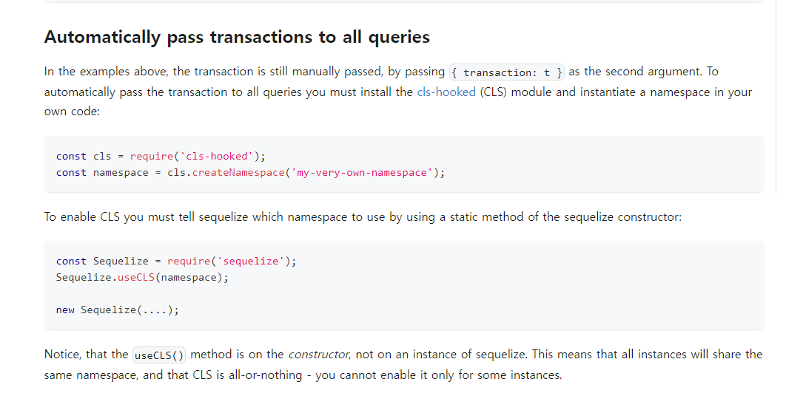

## TL;DL

- 트랜잭션은 대표적인 횡단 관심사(cross-cutting concerns)로 관심사의 분리가 필요하다.
- node.js의 대다수 ORM, ODM은 @Transactional 데코레이터를 지원하지 않는다.
- 트랜잭션의 관심사 분리 문제는 cls-hooked와 uow를 통해 해결할 수 있다.

## 1. 횡단 관심사와 AOP

횡단 관심사는 애플리케이션의 특정 부분의 핵심적인 관심사는 아니지만,
애플리케이션의 여러 부분에 걸쳐 있는 부수적인 관심사의 영역이 될 수 있는 지점을 말한다.
예를 들면 서비스 계층의 관심사는 비즈니스 로직을 처리하는 것이지 트랜잭션을 적용할 지 말지는 서비스 계층의 관심사가 아니다.
마찬가지로 새로운 게시글이 등록되었을 때, 해당 게시글이 속한 카테고리의 포스트 카운트를 증가시키는 것은 게시글 서비스 계층의 관심사일 수는 있어도 post repository의 관심사는 아니다.
이처럼 애플리케이션의 다양한 부분에 적용되어야 하지만, 명확히 특정 부분에 속하지 않고,
여러 계층에 걸쳐있는 지점을 횡단 관심사라고 할 수 있다.
대표적인 횡단 관심사로는 트랜잭션, 캐싱, 로깅 등이 있으며, 이러한 횡단 관심사를 모듈화하여
관심사의 분리를 달성하고 코드의 재사용성을 높여 코드 중복을 최소화를 지향하는 것이 AOP(관점 지향 프로그래밍)이다.

## 2. 트랜잭션과 @Transactional

DB와 관련된 일련의 작업의 ACID를 보장하는 트랜잭션은 대표적인 횡단 관심사이다.
Java의 Spring 프레임워크는 @Transactional이라는 데코레이터를 지원하는데,
서비스 계층의 핵심 관심사가 아닌 트랜잭션을 데코레이터로 모듈화하여 트랜잭션이 동작하도록 하는 로직은 감추고, 서비스 계층과 레포지토리에서는 핵심 로직에만 집중할 수 있도록 하는 역할을 한다.
Node.js 진영에는 다양한 ORM과 ODM이 존재하지만, 스프링 프레임워크의 @Transactional과 같은
데코레이터를 지원하는 라이브러리는 찾아보기 힘들다.
(TypeORM은 0.3버전부터 @Transactional을 지원하지 않으며, Sequelize에서도 지원하지 않는다.)
AOP를 적용하지 못해 서비스 계층에 트랜잭션을 적용한다면 session을 각각의 레포지토리에 전달해줘야 하는 문제점이 있고, 레포지토리에 적용한다면 여러 DB Entity에 대한 처리가 하나의 레포지토리에서 이루어지는 문제가 있다.
이러한 문제점을 잘 보여주는 코드는 다음과 같다.(부트캠프 2차 프로젝트 당시에 작성한 코드)

```ts
public async create(cockflowInfo: CockflowInfo): Promise<ICockflow> {
    const session = await db.startSession();
    try {
      session.startTransaction();
      const cockflow = await new Cockflow(cockflowInfo).save({ session });

      const updateUserFilter = { id: cockflowInfo.owner };
      await User.updateOne(updateUserFilter, { $inc: { points: 50 } }).session(
        session,
      );
      await session.commitTransaction();
      await session.endSession();
      return cockflow;
    } catch (err) {
      await session.abortTransaction();
      await session.endSession();
      throw new AppError(errorNames.databaseError);
    }
  }
```

게시글을 작성하는 핵심 관심사와 더불어 user의 활동 점수를 더해주는 로직이 게시글 모델에 묶이면서 관심사의 분리를 제대로 하지 못했었다.
그 당시에는 AOP에 대한 개념도, 분리할 수 있는 방법도 몰랐었다.
그러던 와중 NestJS 밋업이라는 NestJS 코리아에서 진행하는 세미나를 유튜브로 접하고 횡단 관심사를 해결해보기로 했다.

## 3. cls-hooked vs Unit of Work

CLS는 Continuation Local Storage의 약자로, 특정 스레드에서만 접근할 수 있는 공간을 만드는 것처럼,
서버로 들어오는 각각의 요청에 대해 Namesapce를 생성하고,
하나의 요청 스코프 안에서만 접근 가능한 공간을 만들 수 있도록 하는 라이브러리다.
트랜잭션은 각각의 세션을 별도로 생성한 후, 해당 세션 매니저를 통해 트랜잭션을 관리하므로
특정 request 스코프에서만 접근 가능한 cls-hooked를 활용해 트랜잭션을 관리할 수 있다.
sequelize에서도 cls-hooked를 활용해 세션을 관리한다.



Unit of Work(uow)는 일련의 작업을 하나의 작업 단위로 묶어 처리한다는 의미로,
마이크로소프트의.Net, C# 등에서 활용되는 방식이다.


## 4. cls-hooked를 활용해 코드 개선해보기

블로그 프로젝트에서 트랜잭션을 적용하면서, 포스팅을 할 경우 3개의 스키마(post, sequence, subcategory)에 대해 트랜잭션을 적용해야 하는 상황을 맞이했다.
기능을 구현하고 나니 관심사의 분리는 물론, 모델 계층의 코드가 서비스 계층보다 길어지는 상황이 발생하면서 AOP를 적용해야 할 때가 왔다고 판단했다.
cls-hooked를 적용하기 전의 코드는 다음과 같다.

```ts
create = async (postInfo) => {
  const session = await mongoDb.getSession();
  try {
    const sequence = await this.sequence
      .findOneAndUpdate(
        { collectionName: 'posts' },
        { $inc: { value: 1 } },
        { upsert: true, returnOriginal: false },
      )
      .session(session);
    console.log(sequence);
    const newPost = new Post({
      ...postInfo,
      id: sequence.value,
    });
    await newPost.save({ session });
    await Subcategory.updateOne(
      { _id: postInfo.subcategoryId },
      { $inc: { postCount: 1 } },
    ).session(session);
    await session.commitTransaction();
    return newPost;
  } catch (err) {
    await session.abortTransaction();
    throw new AppError(errorNames.databaseError, 500, '트랜잭션 에러');
  } finally {
    await session.endSession();
  }
};
```

위의 코드는 PostModel에서의 핵심 관심사가 아닌 Sequence와 Subcategory에 대한 처리를 맡고 있다.
cls-hooked에서 로컬 스토리지를 설정하는 역할은 미들웨어에서 맡도록 했는데,
Controller가 실행되기 이전에 cls-hooked를 설정할 수 있고, 트랜잭션이 필요한 Controller에서만 설정할 수 있기 때문이다.

```ts
// cls-hooked/namespace.ts
import { createNamespace } from 'cls-hooked';
import mongoDb from '../../../mongoDb';

export const setSession = async (req, res, next) => {
  let session = createNamespace('session');
  session.run(async function () {
    let TransactionKey = await mongoDb.getSession();
    session.set('transactionKey', TransactionKey);
    next();
  });
};
```

이렇게 미들웨어를 통해 트랜잭션에 필요한 세션을 설정하고 나면, 게시글을 생성하는 PostModel에서 해당 Namespace를 통해 세션을 획득할 수 있다.

```ts
create = async (postInfo) => {
  const session = getNamespace('session').get('transactionKey');
  try {
    const newPost = new Post({
      ...postInfo,
    });
    await newPost.save({ session });
    return newPost;
  } catch (err) {
    await session.abortTransaction();
    session.endSession();
    throw new AppError(errorNames.databaseError, 500, '트랜잭션 에러');
  }
};
```

마찬가지로 sequence, subcategory 모델 계층에서도 Namespace를 통해 세션을 획득하여 트랜잭션을 처리한다.

```
//model/sequence.ts
increaseCollectionValue = async (collectionName: string) => {
    const session = getNamespace('session').get('transactionKey');
    const sequence = await this.findByCollectionName(collectionName);
    sequence.value++;
    try {
      await sequence.save({ session });
      return sequence.value;
    } catch (err) {
      await session.abortTransaction();
      session.endSession();
      throw new AppError(errorNames.databaseError, 500, '트랜잭션 에러');
    }
  };

// model/subcategory.ts
increasePostCount = async (subcategoryId: string) => {
    const session = getNamespace('session').get('transactionKey');
    const subcategory = await this.subcategory.findById(subcategoryId);
    subcategory.postCount++;
    try {
      await subcategory.save({ session });
      await session.commitTransaction();
    } catch (err) {
      await session.abortTransaction();
      throw new AppError(errorNames.databaseError, 500, '트랜잭션 에러');
    } finally {
      await session.endSession();
    }
  };
```

이처럼 컨트롤러 이전에 contitnuation local storage를 통해 세션을 설정함으로써,
서비스 계층에서는 트랜잭션에 대한 처리에 신경쓸 필요가 없고, 모델 계층도 각각의 관심사에 맞게 분리할 수 있었다.
