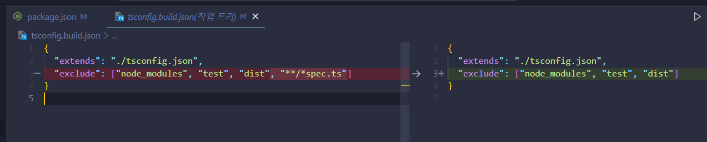
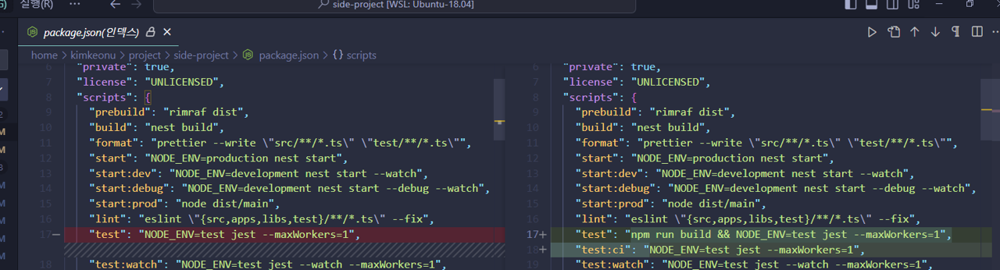
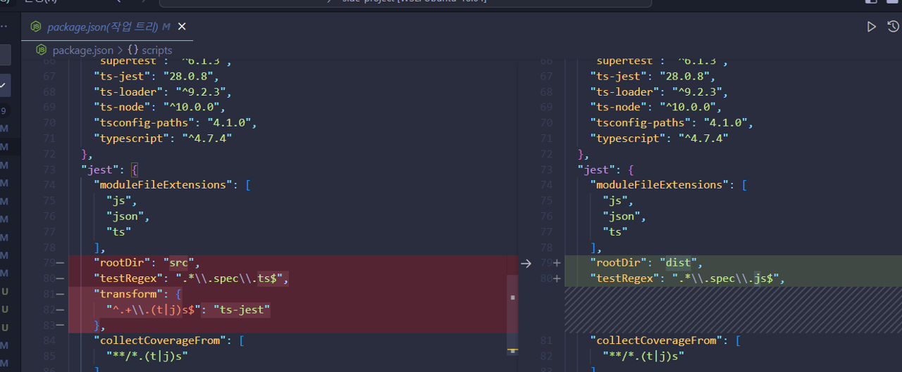
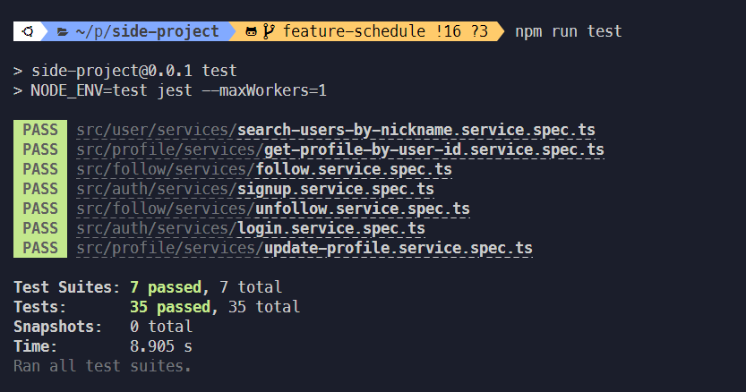
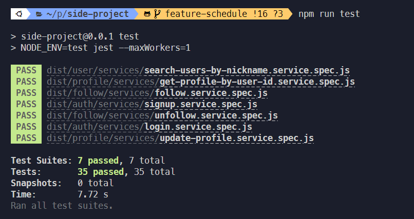
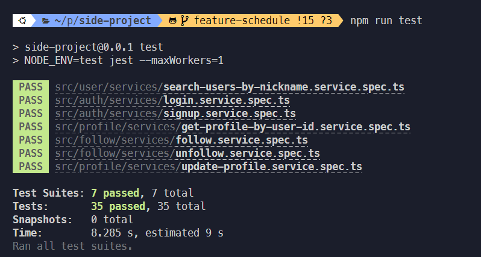
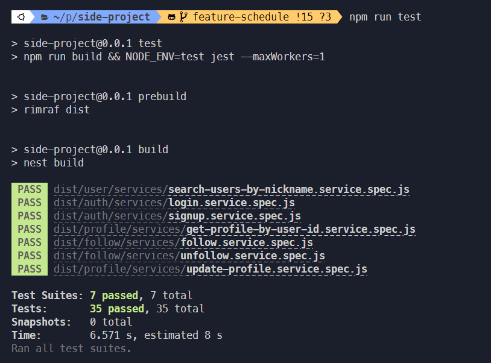
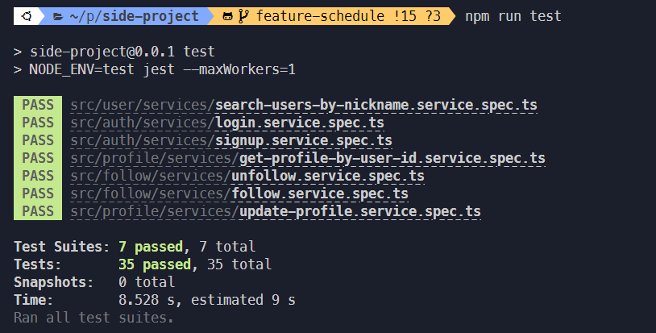
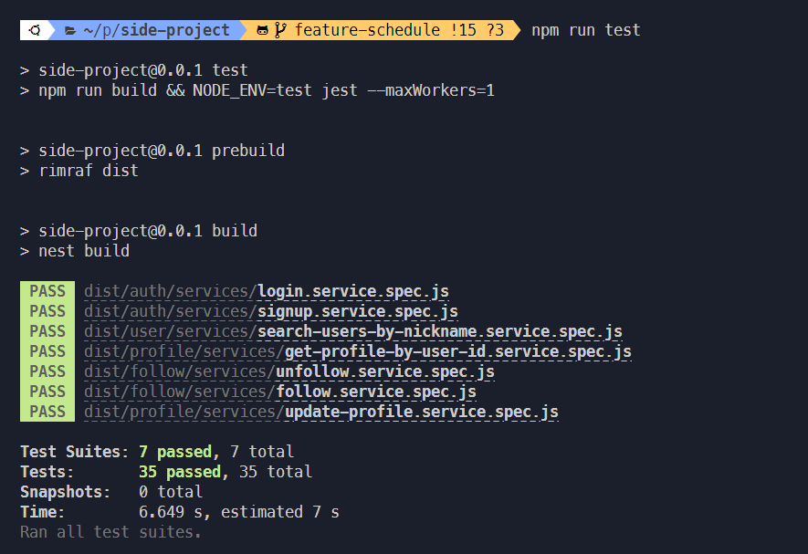

### TL;DR

- NestJS에서 테스트 실행 시 ts-jest를 활용해 테스트를 진행한다.
- ts-jest의 성능 관련 이슈에 대해 읽고나서 테스트 개선에 관심을 갖게 됐다.
- ts-jest를 활용해 typescript 코드를 테스트하는 것 보다 빌드 후 js 코드로 테스트하는 것이 빠르다.

### 테스트에 대한 관심

부트캠프를 진행하면서 부득이(?) 계속 뒤로 미뤘던 것이 두 가지 있는데,
하나는 SQL이고, 하나는 테스트다.
SQL은 프로젝트에서 팀에 누가 될까봐,
테스트는 도무지 무엇을 어떻게 테스트해야 할 지 몰라 미뤘던 것 같다.
NestJS를 공부하게 되면서 드디어 테스트도 진행할 수 있게 됐다.
현재 Planit 서버 코드에는 35개의 Unit 테스트와 28개의 e2e 테스트가 있는데
유닛 테스트는 처음에 5~6초 정도 걸리던 것이 어느새 8초 정도 걸리게 되었다.(뿌듯,,,)
깃허브 액션을 통해 CI를 적용하고 있는 만큼,
테스트 속도를 개선해 보기로 했다.

### 테스트 속도 개선하기

NestJS에서 CLI를 통해 서비스 또는 컨트롤러를 생성할 경우
테스팅 모듈 쉽게 컴파일하여 테스트를 진행할 수 있다.
하지만 이전에 NestJS 밋업 세션 중 테스트와 관련한 세션을 재밌게 봤던 기억이 있어
모듈이 아닌 Mocking 클래스를 직접 주입하는 방식으로 유닛 테스트를 작성해 왔다.
NestJS의 역할 중 하나인 제어의 역전을 거스르는 것이긴 하지만
의존성을 찾아 주입하는 데 걸리는 시간을 단축할 수 있다고 한다.
처음부터 이런 방식으로 작성해 온 터라 얼마나 시간이 단축되었을 지는 모르겠다,,,
오늘 적용해 본 방식은 ts-jest가 아닌 직접 build한 후 테스트를 진행하는 것이었는데,
ts 기반의 테스트가 아닌 js 기반의 테스트이기 때문에 속도가 더 빠르다고 한다.
무엇보다 ts-jest에 성능 이슈가 있다고 하니, 다른 개선책은 분명 필요하겠다.

### ts-jest 사용 안하기

ts-jest를 활용하지 않고 build를 한 후, js 코드로 테스트를 진행하기 위해선 몇 가지 설정 변경이 필요하다.

#### 1. tsconfig.build.json 설정 변경

기본적인 typescript 옵션 이외에 적용되는 tsconfig.build.json은 NestJS 프로젝트를 시작할 때 포함되어 있는 파일이다.
이 파일은 default 설정 파일인 tsconfig.json을 확장하여,
node_modules, test, dist, \**/*spec.ts 파일을 컴파일하지 않도록 설정되어 있었다.
먼저 unit 테스트에 적용해보기로 하여 '\*\*/\*spec.ts'을 삭제해 주었다.

#### 2. package.json 스크립트 수정

이후에는 unit 테스트를 진행하는 스크립트인 test에서
npm run build &&를 추가하여 build 후 테스트를 진행하도록 설정했다.
test:ci 스크립트를 추가한 이유는, 깃허브 액션의 CI 진행 시 build 단계를 따로 두기 위해
로컬에서의 테스트와는 다른 별도의 스크립트를 추가해 두었다.

#### 3. jest config 수정

마지막으로 unit 테스트에 적용되는 jest 설정을 변경해주었는데,
build된 js 코드가 있는 dist 폴더로 root 디렉토리를 변경,
transform 명령을 지우고 test 대상을 js 파일로 변경해 줌으로써 마무리 지었다.

### 얼마나 개선 되었을까

현재 테스트 케이스가 35개 정도밖에 되지 않기 때문에
ts-jest를 사용한 것과 build 후 테스트를 진행한 것의 차이를 명확히 알기는 어렵다.
하지만 기존에 8초 이상 걸리던 테스트는
6~7초 수준으로 15% 정도 속도가 개선되기는 했다!
dist 폴더를 완전히 삭제하고 진행해 보기도 하고,
빌드된 이후 연속으로 테스트를 진행해 보기도 하였는데
속도 개선의 차이는 있지만 확실히 빌드를 통해 js 코드로 진행한 테스트가 확실히 빨랐다.
속도 차이가 얼마 안나면 어쩌나 하고 걱정을 했는데 꽤 유의미한 차이여서 꽤나 뿌듯했다,,,

#### 1. 원래 상태(dist 폴더 존재)에서 진행한 결과

- ts-jest로 테스트

  

- build 후 js 코드로 테스트

  

#### 2. dist 폴더 삭제 후 진행한 결과

- ts-jest로 테스트

  

- build 후 js 코드로 테스트

  

#### 3. 2번 진행 후 연이어 진행한 결과

- ts-jest로 테스트

  

- build 후 js 코드로 테스트

  

### Nest Step

로컬에서의 테스트는 성공적이었지만,
설레는 마음으로 리모트 레포지토리에 push 후 main에 PR을 날리니
액션에서 테스트가 실패했다.
NestJS의 난해한 Config Service 때문이었는데,
급한 불은 껐지만 분명 한 번은 정리하고 가야할 내용인 것 같다.
조만간 환경 변수를 어떻게 관리할 지 확실히 정리해야겠다.
Happy Coding! 😊
