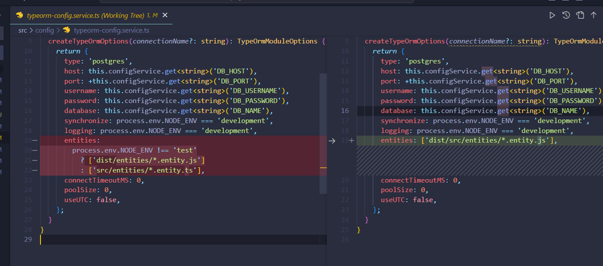
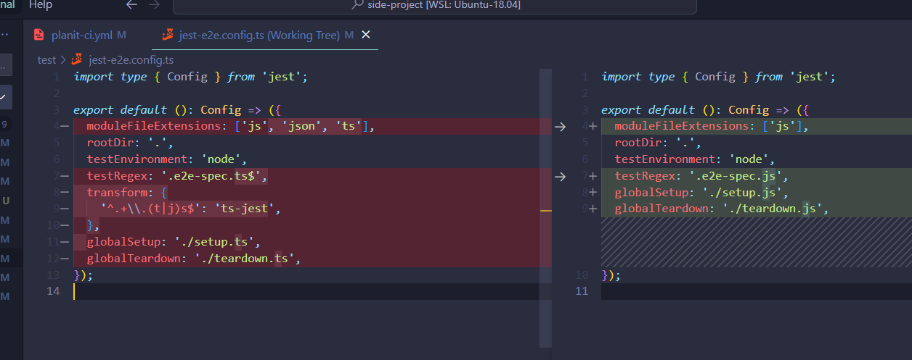
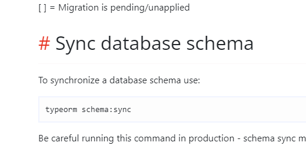
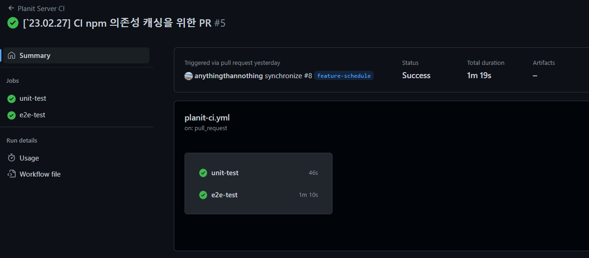
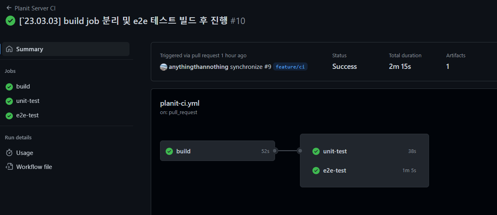

## TL;DR

- e2e 테스트 진행 시 프로덕션 코드로 테스트를 진행하기 위해 빌드 후 진행하도록 변경했다.
- CI 프로세스 진행 시 빌드 Job을 먼저 실행하고, 유닛, e2e 테스트가 병렬적으로 진행되도록 변경했다.
- jest + docker를 활용한 e2e 테스트 방식을 위해 typeorm cli를 적용했다.

## 프로덕션 코드로 e2e 테스트 진행하기

NestJS의 기본적인 테스트 환경은 ts-jest를 활용해서
타입스크립트 코드로 테스트를 진행한다.
이에 따라 js 코드로 진행하는 테스트 대비 속도가 떨어지며,
트랜스파일된 코드가 아닌 타입스크립트 코드로 테스트가 진행된다는 단점이 있다.
테스트 마다 독립적인 환경을 보장하기 위해 docker를 활용해 e2e를 진행하였는데,
빌드, 데이터베이스 관련 설정으로 인해 e2e 테스트를 곧 바로 빌드 후 진행하기에는 무리가 있었다,,,
e2e 테스트 진행 방식을 변경하면서 마주친 어려움들을 정리해 보려고 한다.

## 빌드 관련 설정

ts-jest는 빌드를 진행하지 않고 타입스크립트 코드를 통해 테스트를 진행하기 때문에
빌드를 한 뒤 e2e 테스트를 진행하다보면 경로 문제로 인해 에러가 발생했다.

기존 configService에서 synchronize 시 적용할 entity 파일들은
src 소스코드를 활용했는데, 빌드를 진행하게 되면서 배포/개발/테스트 환경 모두
dist 폴더에 있는 트랜스파일된 js 코드 기반의 entity를 기준으로 synchronized되도록 설정을 변경했다.

e2e 테스트 진행 시 적용되는 jest 설정 파일 또한 ts 확장자를 모두 js로 변경했다.
문제는 기존에 정상적으로 작동하던 typeorm의 dataSource API가 트랜스파일 후
시드 데이터를 삽입하지 못하는 문제가 있었다.
해당 부분은 dataSource의 query 메소드를 통해 순수 쿼리문을 작성하니 쉽게 해결할 수 있었다.
정확한 원인은 파악하지 못했지만, 점진적으로 테스트 환경에서 migration을 통해
DB 설정을 진행할 예정이어서 큰 문제가 되지는 않았다.

```js
test / setup.ts;
// 기존 코드
const setup = async () => {
  await dataSource.initialize();

  await dataSource.manager.insert(Role, { role: 'admin' });

  await dataSource.manager.insert(Role, {
    role: 'basic',
  });

  await dataSource.manager.insert(Image, {
    url: 'avatars/default',
  });
};

// 순수 SQL 쿼리를 통한 데이터 시딩
const setup = async () => {
  await dataSource.initialize();
  await dataSource.manager.query(`INSERT INTO role (role) VALUES ('admin')`);
  await dataSource.manager.query(`INSERT INTO role (role) VALUES ('basic')`);
  await dataSource.manager.query(
    `INSERT INTO image (url) VALUES ('avatars/default')`,
  );
};
```

## 테스트 환경에서의 synchronize

typeorm의 data source api 중에는 .synchronize 메서드가 존재하는데,
Entity 파일을 기반으로 스키마를 자동으로 설정해주는 역할을 한다.
e2e 테스트 환경을 위해 jest의 globalSetup 기능을 활용하여 DB에 연결을 한 후,
synchronize 메서드를 적용했음에도 스키마 싱크 후 테이블이 자동으로 생성되지 않았다.
테스트를 시작하기 전에 schema 싱크를 맞추기 위해서는 typeorm cli를 이용하는 방법이 있었다.

e2e 테스트 시에는 별도의 마이그레이션 파일을 생성하는 것보다 해당 명령어를 통해 손쉽게 스키마 싱크를 맞출 수 있다!
이에 따라 setup.js 파일이 실행되기 전에, 테이블을 생성하고
globalSetup시에는 필요한 시드 데이터만 삽입하도록 변경했다.
스크립트 또한 두 줄만 추가하여 테스트 환경 세팅이 가능했고,
기존 e2e 테스트 스크립트에는 npm run schema:sync를 추가해줬다.

```json
//package.json
"test:e2e": "docker compose up -d test-db && npm run schema:sync && NODE_ENV=test jest --config dist/test/jest-e2e.config.js --maxWorkers=1"
"typeorm": "typeorm-ts-node-commonjs",
"schema:sync": "npm run typeorm schema:sync -- -d test/data-source.ts"
```

## CI 프로세스 수정하기

e2e 테스트 또한 빌드 후 진행하도록 변경하면서 ci 프로세스 또한 일부 수정했다.
기존에는 unit-test, e2e-test 두 개의 job을 병렬적으로 실행하였는데,
공통적으로 필요한 build 프로세스를 분리하여 추가해줬다.
필요한 의존성을 캐싱하고, 빌드된 결과물 arfifacts를 업로드 한 후
각각의 테스트 job에서 빌드하지 않고 다운받도록 수정했다.

```yml
build:
  runs-on: ubuntu-20.04

  steps:
    - name: Get Code from Repository
      uses: actions/checkout@v3

    - name: Use Node.js v.18.
      uses: actions/setup-node@v3
      with:
        node-version: '18.14.2'

    - name: Cache dependencies
      uses: actions/cache@v3
      id: cache-dependencies
      with:
        path: '**/node_modules'
        key: npm-deps-${{ hashFiles('**/package-lock.json') }}

    - name: Install Dependencies
      if: ${{ steps.cache-dependencies.outputs.cache-hit != 'true' }}
      run: npm ci

    - name: Build
      run: npm run build

    - name: Upload Build Artifact
      uses: actions/upload-artifact@v3
      with:
        name: build-artifacts
        path: dist/
```

빌드 자체에 큰 시간이 소요되지 않는 상태기 때문에
오히려 시간이 더 늘어날 수도 있겠다고 예상은 했지만,,,
예상보다 훨씬 더 오랜 시간이 걸렸다,,,

기존에는 병렬적으로 실행한 결과 약 1분 19초가 소요되었는데


빌드 job을 거친 후 각 테스트를 병렬적으로 실행했을 때는 2분 15초가 걸렸다.


build에 걸리는 시간이 길어지고, job이 증가함에 따라
artifact를 업로드하고, 다운로드 하는 것이 점점 효율적이게 되겠지만
불필요한 action들이 있는 지 확인해 봐야겠다.
그래도 테스트 방식을 일원화한 거,
ci 프로세스를 어느 정도 마무리했다는 게 꽤 뿌듯했다!

Happy Coding! 😊
