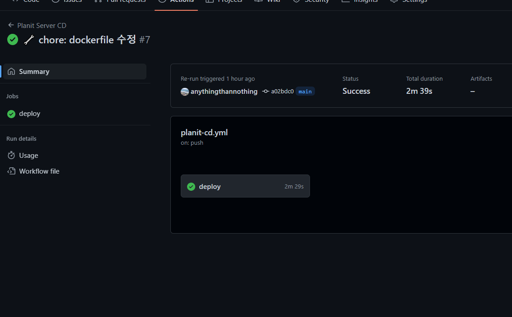

## TL;DR

- Github Actions를 활용해 배포를 자동화할 수 있다.
- Continuous Deployment/Delivery에는 다양한 방식이 존재한다.
- ssh command action을 적용해 스테이징 환경에 배포를 진행했다.

## CD 프로세스 적용하기

CI/CD는 빌드와 테스트, 저장소 관리를 자동화하는 CI(Continuous Integration)와
개발 환경으로의 지속적인 제공(Delivery), 운영 환경으로의 지속적인 배포(Deploy)를 의미하는
CD(Continuous Deployment/Delivery)로 나눌 수 있다.
기존에는 원격 저장소인 Github에 코드 Push ➡ PR ➡ Merge 후 해당 코드를 바탕으로
VM에 접속해 코드를 Pull 받고 의존성을 설치하고, 빌드를 진행하고 서버를 실행하는 작업을 수동으로 진행해왔다.
사이드 프로젝트를 진행하면서 FE에서 서버 코드를 따로 관리하는 것이 번거로울 것 같아
스테이징 환경을 구축하고 활용해왔는데, 이번에 CD 프로세스를 적용해 보았다.

## Continuos Deployment

아직은 사이드 프로젝트 초기 단계로, 실제 서비스를 배포해서 운영 중이지 않기 때문에
스테이징 환경에 배포하는 Delivery를 목표로 진행하였는데,

1. 그 과정에서 AWS CodeDeploy와 S3를 활용하는 방식,
2. EC2에 직접 접속해서 일련의 명령어를 실행하는 방식,
3. self-hosted runner를 이용하는 방식
4. ECS와 같은 컨테이너 서비스

등 다양한 전략이 존재한다는 것을 알게 되었다.
특히 Docker를 활용하고 있기 때문에, 단순히 코드를 push하고 pull하는 방식보다는
Dokcerize하여 도커 허브에 업로드하고, 해당 이미지를 기반으로 배포되도록 진행했다.

## planit-cd.yml

CD 프로세스를 구축하면서 이런저런 방식을 적용해보고, 문제점들을 확인하는 과정을 거치면서
1차적으로 완성한 야믈 파일의 세부 내용들은 다음과 같다.

```yml
name: Planit Server CD
# main에 merge되었을 때 실행
on:
  push:
    branches: [main]
```

PR 시 테스트를 진행하는 CI의 이벤트 트리거와는 달리,
배포 시에는 PR이 main 브랜치에 Merge되었을 때 워크플로우가 실행되도록 설정해줬다.(on ➡ push ➡ branches ➡ main)
Github Actions에는 별도의 Merger 이벤트가 존재하지 않는데,
검색해보니 PR이 Merge가 되었을 때 push 이벤트가 발생한다고 한다.

```yml
jobs:
  deploy:
    runs-on: ubuntu-20.04

    steps:
      - name: Get Code from Repository
        uses: actions/checkout@v3

      - name: Use Node.js v.18.
        uses: actions/setup-node@v3
        with:
          node-version: '18.14.2'

      - run: docker build -t farenheim7/planit-dev-server:latest -f dockerfiles/api-server.dockerfile .

      - run: echo "${{ secrets.DOCKER_HUB_ACCESS_TOKEN }}" | docker login -u ${{ secrets.DOCKER_HUB_USERNAME}} --password-stdin

      - run: docker push farenheim7/planit-dev-server:latest
```

굳이 도커를 이용한 이유는 기존에 VM 또한 Node.js와 같은 의존성 없이 도커 이미지만으로 운영하고 있었기도 하고,
추후에 버전 관리 및 재사용성을 높이기 위해 도커로 관리하는 편이 나을 것 같다고 판단했기 때문이다.
Github Actions를 적용해보면서 linux에 대해 더 깊게 공부해야 할 필요성을 느낄 수 있었는데,
pipe와 같은 기능들을 실제로 적용해볼 수도 있었고,
EC2에 접속하기 위해 access key를 직접 생성해야 했기 때문이다.

```yml
- name: SSH to AWS EC2
        uses: appleboy/ssh-action@v0.1.8
        with:
          host: ${{ secrets.EC2_HOST }}
          username: ${{ secrets.EC2_USERNAME }}
          key: ${{ secrets.EC2_SECRET }}
          port: ${{ secrets.EC2_PORT }}
          passphrase: ${{ secrets.EC2_PASSPHRASE }}
          script: |
            echo "${{ secrets.DOCKER_HUB_ACCESS_TOKEN }}" | docker login -u ${{ secrets.DOCKER_HUB_USERNAME}} --password-stdin
            docker stop planit-server
            docker image rm farenheim7/planit-dev-server:latest
            docker run --rm -dp 8000:8000 --name planit-server --env-file ./server/.env.development farenheim7/planit-dev-server:latest
```

SSH를 이용해 EC2 인스턴스에 접속하여 명령어를 실행하는 방식에는
깃허브 액션에서 self-hosted 러너를 등록하거나 appleboy/ssh-action을 활용하는 방법이 있다.
이 중에서 후자를 선택해서 진행했고, 블로그 CD 프로세스는 self-hosted 러너를 적용해볼 예정이다.
linux 운영체제에서 ssh를 위해 액세스 키를 생성하는 부분이 어려웠는데,
해당 부분은 따로 포스팅하면서 다시 한 번 공부해봐야겠다.

## 더 개선해야할 부분

현재 CD 프로세스의 문제는 환경 변수를 원격 저장소에 push하지 못하기 때문에
VM에 env 파일을 직접 입력해뒀는데, 코드와 필요한 의존성을 모두 도커 이미지에 담기 위해 해당 부분을 개선해보려고 한다.
또한 도커허브에 이미지를 푸쉬하고, EC2에 접속해서 직접 실행하는 명령어를 진행하는 부분은
추후 한 대 이상의 VM을 이용하거나 동적으로 운영될 경우 제약사항이 많아 어떻게 개선해야 할 지 공부해볼 예정이다.
AWS의 CodeDeploy나 ECS를 활용하는 방식의 Free-tier 정책이 어떻게 되는지도 알아볼 예정!
또한 현재는 태그를 :latest로만 해둔 상태이기 때문에 기존 컨테이너를 중단하고, 이미지를 삭제해야 하는 작업이 반복된다.
태그를 동적으로 부여해서 버전 관리와 컨테이너 재시작 과정을 단축하는 부분도 개선이 필요할 것 같다,,,
그래도 일단은 성공했다는 점에 만족하기로!



Happy Coding! 😊
