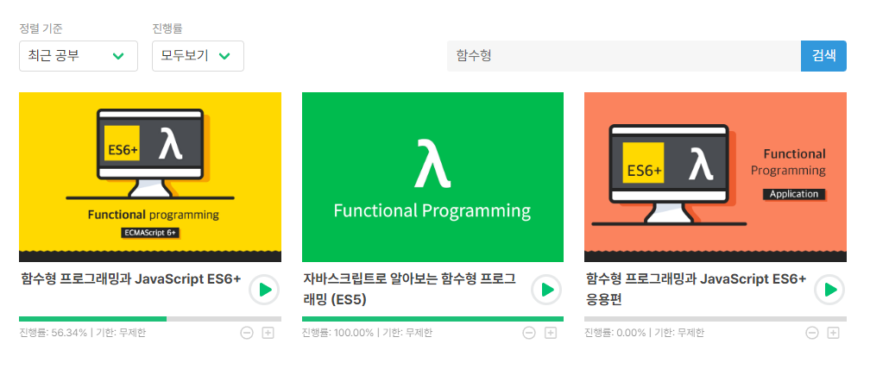

## TL;DL

- 함수형 프로그래밍을 통해 가독성과 성능을 높일 수 있다.
- O(N \* M)의 작업을 group by, count by 함수로 간편하게 O(N + M)으로 개선할 수 있다.

## 두 개의 배열에서 짝을 지어야 하는 코드들

코드를 작성하다 보면, 두 개의 배열에서 짝을 짓거나 특정 조건을 만족하는 쌍을 찾는 등,
중첩된 for문을 통해 해결할 수 있는 코드들을 만나게 된다.
for문의 가독성을 높이기 위해 find 메서드를 사용할 수도 있고,
O(N \* N)의 성능을 개선하기 위해 map과 같은 자료구조를 활용할 수도 있다.
부트캠프에서 진행한 칵테일러에서는 1-depth짜리 대댓글 기능을 구현하면서
특정 게시글에 속한 전체 댓글을 조회한 후 댓글에 대한 대댓글을 짝지어야 하는 상황이 있었다.

```ts
import {
  GetCockflowServiceDto,
  CockflowSubComment,
} from '../types/cockflowType';

export const formatCockflow = (cockflow: GetCockflowServiceDto) => {
  if (cockflow.commentsCount === null) {
    cockflow.comments = [];
    delete cockflow.commentsCount;
    delete cockflow.subComments;
    return cockflow;
  }
  const subComments = cockflow.subComments;

  const formattedSubComments: Map<string, CockflowSubComment[]> = new Map();

  for (const subComment of subComments as CockflowSubComment[]) {
    if (!formattedSubComments.has(subComment.parentCommentId)) {
      formattedSubComments.set(subComment.parentCommentId, []);
    }
    formattedSubComments.get(subComment.parentCommentId)?.push(subComment);
  }

  const comments = cockflow.comments;

  for (const comment of comments) {
    comment.subComments = [];
    if (formattedSubComments.has(comment._id.toString())) {
      comment.subComments = formattedSubComments.get(
        comment._id.toString(),
      ) as CockflowSubComment[];
    }
  }
  delete cockflow.commentsCount;
  delete cockflow.subComments;
  return cockflow;
};
```

리팩토링을 진행하지는 않아 부끄럽지만, 대략 map을 통해 서브 코멘트를 parentCommentId로 묶고,
각 코멘트를 순회하며 대댓글을 매칭해주는 로직이다.
그 당시에 코드를 작성하면서도, 이것보다는 좋은 방식이 있을텐데...라는 고민을 하였지만
기능 구현이 급한 상황이라 O(N + M)으로 성능을 개선한 것에 만족했다.

## 함수형 프로그래밍을 공부하는 이유

코드를 작성하면서도 이렇게 작성하면 안되겠다는 느낌을 받지만,
기능을 빠르게 구현해야 한다는 압박감에 우선은 성능에만 초점을 맞추는 경우가 많았다.
코드가 길어지는 것은 물론 가독성이 떨어지면서 항상 어떻게 하면 간결하면서도 성능을 높일 수 있을까를 고민했었다.
뚜렷한 해결책을 찾지는 못하던 와중에 함수형 프로그래밍을 공부하면서 가독성과 성능 모두를 만족시킬 수 있겠다는 생각이 들어 인프런의 함수형 프로그래밍과 JavaScript 강의를 수강하게 되었다.



다양한 함수가 있지만, 그 중에서도 앞선 상황에 적용할 수 있는 함수는 group by 함수로,
특정 값을 key, 해당 키를 만족하는 요소들의 배열을 value로 하는 객체를 손쉽게 만들 수 있다.
비슷한 역할을 하는 함수로 count by가 있는데, 해당 함수는 특정 값을 key, 해당 key 값을 갖는 요소의 개수를 value로 하는 객체를 반환하는 역할을 한다.
특정 조건을 만족하는 요소들의 배열을 반환하는 지, 개수를 반환하는 지가 두 함수의 큰 차이점이다.
planit에서는 아직까지 group by를 적용할 만한 기능은 없는 상태지만,
닉네임으로 유저를 검색하고, 해당 유저를 팔로우 중인지 체크하여 클라이언트에 전달해야 하는 요구사항이 있었다.
만약 함수형 프로그래밍을 적용하지 않고 코드를 간견하게 작성한다면 다음과 같이 작성할 수 있다.

```ts
const { userId, nickname } = params;
const profiles = await this.searchUsersByNicknameOutboundPort.execute(nickname);
const followingIds = profiles.map((profile) => profile.user.id);
const follows = await this.checkFollowingOutboundPort.execute({
  followerId: userId,
  followingIds,
});
const followingUsers = follows.map((follow) => follow.followingId);
```

유저의 프로필을 검색하고, 프로필에 해당하는 유저의 id를 수집해 팔로우 테이블에서 조회한 id와 비교해가며 팔로우 여부를 확인할 수 있다.
위 코드는 O(N \* N보다 작거나 같은 수)의 시간 복잡도를 가지기 때문에 성능 개선이 필요하다.
동일한 역할을 하지만, count by 함수를 활용하면 비슷한 코드량으로 성능 개선을 달성할 수 있다.

```ts
const { userId, nickname } = params;
const profiles = await this.searchUsersByNicknameOutboundPort.execute(nickname);
const followingIds = pipe(
  map((profile) => profile.user.userId, profiles),
  toArray,
);
const follows = await this.checkFollowingOutboundPort.execute({
  followerId: userId,
  followingIds,
});
const followingUsers = countBy((follow) => follow.followingId, follows);
```

위의 코드는 줄 바꿈과 이터러블을 array로 전환하는 코드로 인해 줄 수는 조금 늘어났지만,
O(N + N보다 작은 수)의 시간 복잡도로 성능이 개선되었다.

## Mocking에 활용하기

앞선 서비스 계층의 코드 개선뿐만 아니라 다양한 함수들을 테스트 Mocking에도 적용할 수 있는데,

```ts
class MockCheckFollowingOutboundPort implements CheckFollowingOutboundPort {
  constructor(private follows: Follow[]) {
    this.follows = follows;
  }
  async execute(params: CheckFollowingOutboundPortInputDto): Promise<Follow[]> {
    const { followerId, followingIds } = params;
    const followingUsers = countBy(
      (followingUser) => followingUser,
      followingIds,
    );

    return Promise.resolve(
      filter(
        (follow) =>
          follow.followerId === followerId &&
          followingUsers[follow.followingId],
        this.follows,
      ),
    );
  }
}
```

레포지토리를 Mocking하는 경우, DB에서 index를 기반으로 조회하는 것처럼 count by를 통해 성능을 개선할 수 있다.
count by 함수의 목적이 개수를 세는 것이긴 하지만, 존재하지 않는 key는 반환되는 객체에서 undefined가 될 것이고, 존재하는 경우에는 1의 값을 가지기 때문에 boolean처럼 활용할 수 있다.
