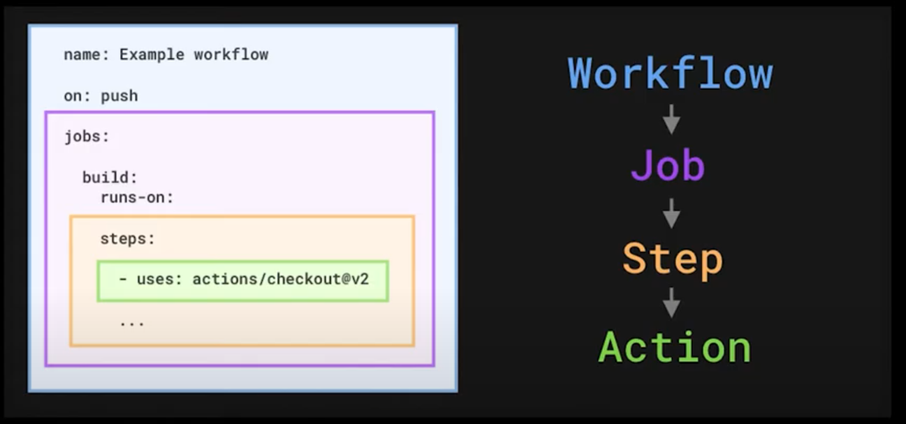

## TL;DR

- 개발, 빌드, 테스트, 배포의 사이클을 자동화하는 것을 CI/CD라고 한다.
- Github Actions는 Github에서 제공하는 CI/CD 툴이다.
- Github Actions는 Workflow ➡ Job ➡ Step ➡ Action을 기반으로 동작한다.

## CI/CD

코드 작성부터 빌드, 테스트, 배포까지, 일련의 과정을 자동화하는 것을 CI/CD라고 한다.
CI는 **지속적 통합(Continuous Integration)**의 약자로,
개발 ➡ 빌드 ➡ 테스트 사이클을 자동화하는 것을 의미한다.
CD는 **지속적 제공(Delivery) 또는 배포(Deployment)**의 약자로,
테스트를 마친 빌드 코드를 개발 환경, 또는 운영 환경에 배포하는 것을 의미한다.
개발 환경까지 배포를 자동화하는 것을 Continuous Delivery(제공),
운영 환경까지 배포를 자동화하는 것을 Continuous Deployment(배포)로 구분한다.

## Github Actions

깃허브 액션은 깃허브에서 사용할 수 있는 CI/CD 툴로,
원격 저장소와 CI/CD를 한 곳에서 관리할 수 있고,
yml 파일을 활용해 문법이 쉽다는 장점이 있어 큰 인기를 끌고 있다.
깃허브 액션의 CI/CD를 구성하는 요소는 크게 4가지로 구분할 수 있다.

### 1. Workflow

깃허브 액션의 구성 요소 중 가장 상위의 요소로 여러 Job을 포함할 수 있다.
Workflow의 역할은 해당 작업이 언제 동작해야 하는 지 결정하는 역할을 한다.
on 키워드와 함께 push, pull_request 등 다양한 이벤트를 지정할 수 있으며,
이벤트가 발생하는 브랜치와 특정 동작만을 지정할 수도 있다.
이벤트의 종류는

1. schedule: 일정 주기로 반복적으로 실행(cron식 활용)
2. webhook: push, pull_request, issues 등 레포지토리의 특정 동작에 의해 발생
3. manual: workflow_dispatch 등 개발자가 수동으로 발생시키는 이벤트

등이 있다.

### 2. Job

워크플로우를 구성하는 여러 가지 작업들의 묶음으로,
워크플로우는 하나의 Job만을 가질 수도 있고 여러 Job을 통해 구성될 수도 있다.
각 Job은 Identifier를 통해 구분되며 독립적인 가상 머신에서 동작하는 작업 단위이다.
달리 말하면 서로 다른 Job은 서로 다른 가상 머신 상에서 동작한다.

### 3. Step & Action

step은 여러 가지 action들의 묶음으로 각각의 action들은 순차적으로 실행된다.
action은 custom 액션을 직접 작성하여 활용할 수도 있으며,
레포지토리의 코드를 가져오는 checkout, 의존성 등을 캐시하여 재활용할 수 있는 cache 등
공식 인증을 받은 다양한 action들이 존재한다.
