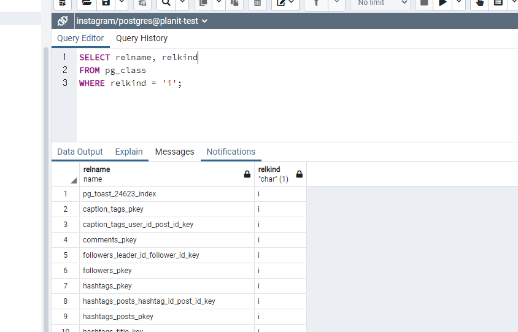
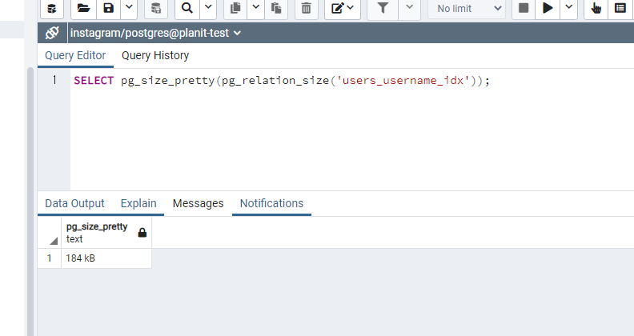

## TL;DR

- Index의 활용 없이 전체 테이블을 순차적으로 접근하는 방식을 Full Table Scan이라고 한다.
- 특정 레코드와 해당 레코드를 가리키는 포인터의 쌍인 Index를 활용하여 읽기 성능을 개선할 수 있다.
- 인덱스를 설정할 때는 추가 저장 용량, 쓰기 빈도, DBMS의 Index 사용 여부, Index Key Size, Cardinality를 고려해야 한다.

## Full Table Scan vs Index

SQL 쿼리가 실행될 때 인덱스되지 않은 컬럼을 조회할 경우 테이블 내의 모든 Page를 조회하고 읽어들인다.
이 과정을 통해 Heap에 저장되어 있는 데이터를 메모리에 임시 저장한 후,
쿼리를 만족하는 데이터를 순차적으로 찾는 과정을 Full Table Scan이라고 한다.
일반적으로 Full Table Scan은 비효율적이며 느린 작업 속도를 갖는다.
이러한 문제는 Index를 통해 해결할 수 있는데,
Index란 특정 레코드가 저장되어 있는 주소 정보를 담고 있는 자료구조를 뜻한다.
Index에는 인덱싱의 대상이 되는 컬럼의 데이터와 위치 정보만을 저장하며,
오름차순 또는 내림차순 등 특정한 정렬 기준에 의해 데이터가 저장된다.

## Index 생성하기

인덱스는 테이블의 Primary Key와 Unique 제약 조건을 갖는 컬럼에 자동으로 설정된다.
하지만 DBMS에 의해 생성된 index는 pgAdmin 등 UI 툴을 통해서는 확인할 수 없다.
DB에 존재하는 모든 Object의 정보를 담은 pg_class 테이블을 통해 인덱스 정보를 확인할 수 있다.

```sql
SELECT relname, relkind
FROM pg_class
WHERE relkind = 'i';
```



Index는 테이블이 생성된 이후에도 설정할 수 있으며 다음과 같이 테이블명과 인덱스를 생성할 컬럼명을 적어준다.
INDEX와 ON 사이에 인덱스의 명칭을 명시할 수도 있지만, 생략할 경우
'{TABLE_NAME}\_{COLUMN_NAME}\_idx'와 같은 형태로 자동 지정된다.

```sql
CREATE INDEX ON {TABLE_NAME} ({COLUMN_NAME});

-- EX) CREATE INDEX ON users (username);

-- 인덱스명을 별도로 지정할 경우
-- EX) CREATE INDEX users_username_index users (username);
```

존재하는 인덱스를 삭제할 경우 다음과 같은 명령어를 사용할 수 있다.

```sql
DROP INDEX {INDEX_NAME};

-- DROP INDEX users_username_idx;
```

인덱스는 쿼리의 속도를 드라마틱하게 개선해주지만,
자료구조인 Index를 저장하기 위한 추가적인 저장공간이 필요하다.
특정 Index가 차지하는 용량을 확인하는 쿼리는 다음과 같다.

```sql
SELECT pg_size_pretty(pg_relation_size('{INDEX_NAME}'));

-- EX) SELECT pg_size_pretty(pg_relation_size('users_username_idx'));
```



## Index 적용할 때 주의해야할 점

인덱스를 저장하기 위한 추가적인 저장공간뿐만 아니라 인덱스를 설정할 때 주의해야 할 점들이 존재한다.

### 1. WRITE(INSERT/UPDATE/DELETE) 작업 속도 저하

인덱스는 원하는 데이터를 빠르게 조회하기 위한 도구이면서,
데이터 쓰기 작업 시에는 인덱스를 수정해야 하는 작업이 수반되어야 하기 때문에 쓰기 작업 속도는 저하된다.
따라서 쓰기 작업이 빈번한 컬럼의 경우에는 인덱스를 적용하는 데에 있어 신중해야 한다.

### 2. Index의 사용 여부

특정 컬럼에 인덱스가 적용되었다고 하더라도, DBMS가 해당 인덱스를 사용하지 않을 수도 있다.
인덱스를 설정한 경우에는 실행 계획을 살펴보며 원하는 대로 인덱스가 사용되는 지 확인하고,
불필요한 인덱스는 삭제하는 등 꾸준히 관리할 필요가 있다.

### 3. Index Key의 크기

인덱스의 원리는 인덱싱하고자 하는 Key 값과 해당 Key 값의 위치를 가리키는 Pointer를 별도로 저장하는 것이다.
SQL에서는 데이터를 Page 단위로 저장하는데,
Index Key의 값이 커지면 커질수록 한 Page 내에 저장되는 인덱스의 수가 줄어들기 때문에
쿼리 속도와 저장용량 측면에서 효용성이 떨어지게 된다.

### 4. 데이터의 중복 정도(Cardinality)

이메일, 휴대폰 번호와 같이 중복 가능성이 없을 경우 인덱스의 효율이 극대화되는 반면,
성별, 지역과 같이 중복 가능성이 높은 컬럼의 경우 중복 데이터로 인해 쿼리 효율이 떨어지게 된다.
