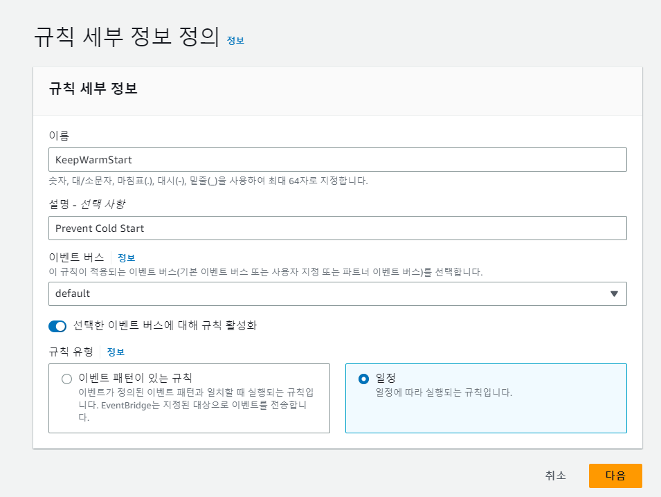

## TL;DR

- AWS 람다 서비스 클라우드의 서버리스의 대표적인 서비스로 컨테이너 위에서 동작한다.
- 람다가 실행되는 서버는 약 5분 간 새로운 요청이 없을 경우 해당 컨테이너를 종료한다.
- 이러한 특성으로 인해 람다에는 콜드 스타트 문제가 존재하며 다양한 해결 방법이 존재한다.

## 람다와 컨테이너

AWS Lambda는 서버리스의 원조라고 할 수 있는 클라우드 서비스로,
사용자가 관리해야할 서버 없이도 특정 함수를 동작시킬 수 있도록 하는 역할을 한다.
별도의 서버를 구축할 필요도 없고, 사용한 만큼만 비용을 지불하면 되며, 스케일링 또한 자동으로 지원되기 때문에 다양한 분야에서 람다를 적용해 사용할 수 있다.
람다와 같은 서비스를 서버리스 컴퓨팅, FaaS(Function as a Service)라고도 한다.
람다는 확장성을 위해 컨테이너를 기반으로 동작하는데,
해당 컨테이너는 이후 들어오는 요청에 재활용된다.
AWS의 서버는 람다 컨테이너가 장시간(약 5분) 호출되지 않으면 리소스를 절감하기 위해 해당 컨테이너를 종료한다.
람다는 다음과 같이 함수 실행을 위해 코드를 다운받고, 컨테이너를 실행하고, 런타임을 구성하는 과정을 거쳐 함수를 실행하기 때문에 콜드 스타트 문제가 발생하게 된다.


## Cold Start

코드를 다운 받고, 컨테이너를 시작하는 부분은 컨테이너가 종료될 경우 매번 실행되는 부분이다.(Full Cold Start)
런타임 환경을 구성하는 부분은 DB에 연결하거나, 전역 변수를 설정하는 등 매번 실행되는 부분이 아니라 컨테이너가 시작되고 람다의 함수(handler)가 시작되기 전에 최초 1회만 실행되는 부분이다.(Partial Cold Start)
컨테이너가 종료되기 전에 람다 함수가 호출되는 상황이 Warm Start가 된다.
이를 테스트 해보기 위한 코드는 다음과 같으며, 빨간색으로 표시한 부분이 런타임 환경을 구성하는 코드 블록이다.


해당 코드를 람다에 등록한 후 테스트해보면, 최초 1회의 요청에 대해서는 Cold Start와 로그가 찍히는 것을 확인할 수 있고,
5분 이내의 재요청에 대해서는 Warm Start와 로그가 찍히지 않는 것을 확인할 수 있다.


콜드 스타트로 호출될 경우 Init Duration에 0.2초가 소요된 것을 확인할 수 있으며, 전역에 작성된 console.log가 작동된다.


이와 달리, Warm Start를 하게 될 경우 console.log는 동작하지 않고, Init Duration 또한 소요되지 않는다.
해당 코드는 아무런 의존성이 없는 단순한 함수로 필요한 의존성이 추가되거나 로직이 복잡해 질 수록 콜트 스타트에 따른 처리 시간 지연의 영향이 커질 수 있다.

## Warm Start를 유지하는 방법

만약 함수가 DB에 접근해야 한다면 DB와의 연결을 유지시키는 것이 효과적일 것이며,
여러 의존성을 가지고 있을 경우 Init Duration이 크게 증가할 수 있다.
Cold Start를 해결하기 위해서는 AWS 람다의 사양 자체를 높이거나,
프로비저닝을 통해 동시에 호출될 수 있는 최소한의 람다 함수의 수를 조절할 수 있다.
하지만 이러한 방법은 비용과 직접적으로 연관되어 있기 때문에
람다 함수의 최적화를 위해서는 컨테이너가 종료되지 않도록 5분만다 람다 함수를 호출하여 해결하는 방법을 고려해볼 수 있다.

## CloudWatch Event Bridge

AWS의 EventBridge를 활용하면 특정 이벤트를 발행하여 람다 함수를 호출할 수 있다.




다음 코드는 클라이언트의 요청에 대해 presigned-url을 발급하는 람다 코드다.
이벤트 상수로 JSON을 전달하여 event.body.type이 PreventColdStart일 경우 즉시 응답하도록 하여 콜드 스타트를 예방할 수 있다.

```js
const { S3Client, PutObjectCommand } = require('@aws-sdk/client-s3');
const { getSignedUrl } = require('@aws-sdk/s3-request-presigner');

const s3 = new S3Client({
  region: 'ap-northeast-2',
  credentials: {
    accessKeyId: process.env.accessKeyId,
    secretAccessKey: process.env.secretAccessKey,
  },
});

module.exports.handler = async function (event) {
  if (event.body.type === 'PreventColdStart') {
    return { statusCode: 204 };
  }
  const body = JSON.parse(event.body);
  const { folder } = body;
  const params = {
    Bucket: process.env.S3_BUCKET,
    Key: `${folder}/${Date.now()}`,
  };
  const command = new PutObjectCommand(params);

  const presignedURL = await getSignedUrl(s3, command, { expiresIn: 600 });
  const response = {
    statusCode: 200,
    body: presignedURL,
  };
  return response;
};
```
