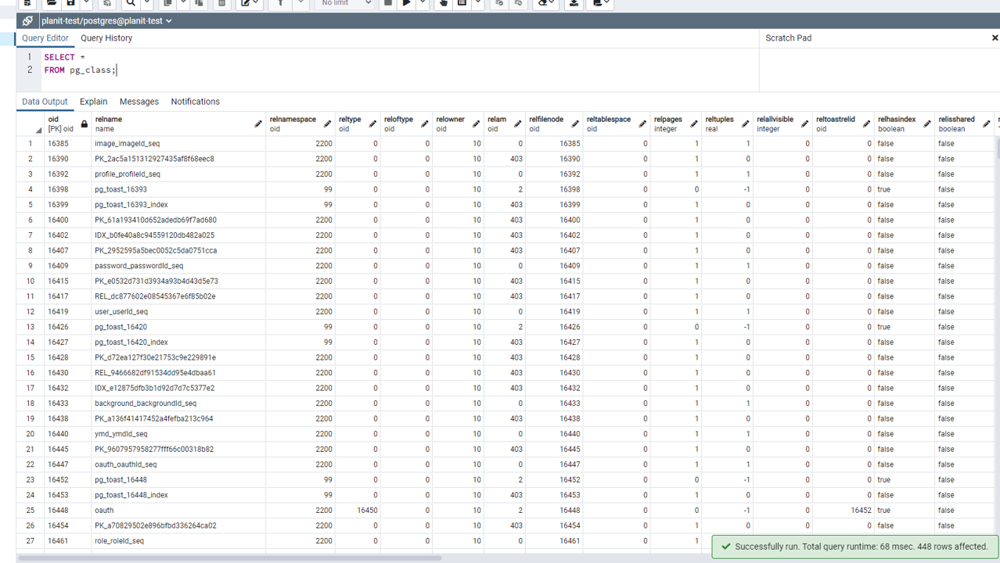

## TL;DR

- 다양한 명령어를 통해 PSQL의 데이터 저장 위치와 Object 관려 정보를 확인할 수 있다.
- 각 DB의 테이블들은 Tuple ➡ Page ➡ Heap 구조로 이루어져 있다.
- Heap은 8kb의 크기를 가지는 Page들의 묶음이다.

## PostgreSQL은 어디에 데이터를 저장할까

포스트그레스는 컴퓨터의 특정 디렉토리(하드디스크)에 데이터를 저장한다.
데이터가 저장되는 정확한 위치는 'SHOW data_directory;' 명령어를 통해 확인할 수 있다.
linux 환경에서는 기본적으로 '/var/lib/postgresql/data' 경로의 'base'폴더에 데이터가 저장된다.
'SELECT oid, datname FROM pg_database;' 명령어를 통해
각 DB의 id와 DB 이름을 확인할 수 있다.

base 폴더에는 이러한 id를 폴더명으로 하는 다양한 폴더가 존재하며
'SELECT \* FROM pg_class;' 명령어를 통해 폴더 내에 존재하는 파일의 역할을 확인할 수 있다.
각 파일은 DB에 존재하는 Object를 나타내는데, 테이블, 관계, 인덱스, 시퀀스, PK 등이 Object에 속한다.

결과적으로 PostgreSQL은 하드디스크 내에 id를 폴더명으로 하는 특정 경로에 각각의 DB에 대한 모든 정보를 저장한다고 할 수 있다.

## Heap & Tuple & Page

Heap(또는 Heap File)은 테이블 내에 존재하는 모든 데이터를 담은 파일을 지칭한다.
Tuple(또는 Item)은 Heap 파일에 존재하는 각각의 row를 의미하며,
Page(또는 Block)는 Heap 파일에 존재하는 모든 row가 분리되어 보관되는 공간을 뜻한다.
Heap 파일은 여러 개의 분리된 Page로 나타낼 수 있으며,
각각의 Page는 각기 다른 여러 개의 Tuple을 저장하고 있으며,
Tuple의 수와는 관계없이 8kb의 크기를 지닌다.
8kb의 Page에는 Page 정보, 각 Tuple의 위치와 데이터가 바이너리 데이터로 저장되어 있다.
Page 정보와 Tuple의 위치는 Page의 상단에서부터, Tuple 데이터는 하단에서부터 저장되며,
그 사이는 빈 공간으로 Tuple이 추가될 수 있도록 비워놓는 공간이다.

